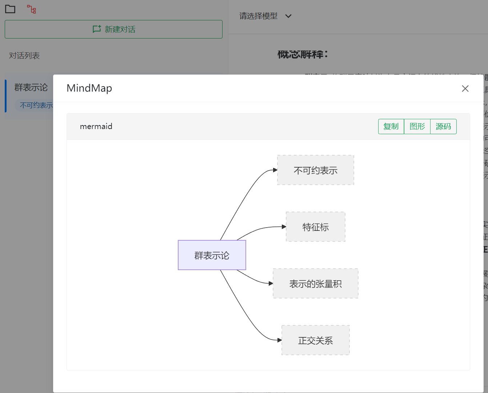

# DeepLink

主要功能点讲解

## 支持的系统指令
* '/rename': 给当前对话重命名
* '/link': 给当前对话中的增加标签， example: "/link 线性空间,正交性"
* '/unlink': 删除当前对话中的标签， example: "/unlink xxx,xxx,xxx"
* '/note': 单纯记笔记用，不会触发大模型调用
* '/tag':  暂未支持
* '/help':  暂未支持

## 内置prompt
* /ch2en: 用法: "/ch2en 群表示论"
* /en2ch：用法类似
* /overview
* /decomp
* --detail

以上是内置的prompt, 这些prompt的完整内容可以在管理页面中直接看到，就能知道其作用。内置的prompt主要作为示例，用户可以根据自己的需求修改，或者新增新的prompt。

### prompt语法
/开头的prompt指令(非系统指令)中会有 "{{}}", 系统会自动把花括号中替换指令后面的文本； 即是一种模板

--开头的指令会自动扩展成指令的内容放在prompt最后，作为补充说明，比如可以用作输出格式说明

## 思维导图
对话框最上面有个图标点击会展示出目前目录下所有对话中tag形成的思维导图，注意对话名称本身也是tag， 所以注意管理好对话名称，使其有意义。目前这个功能有bug，打开后第一次点击时渲染有问题，请关闭后再重新打开。

